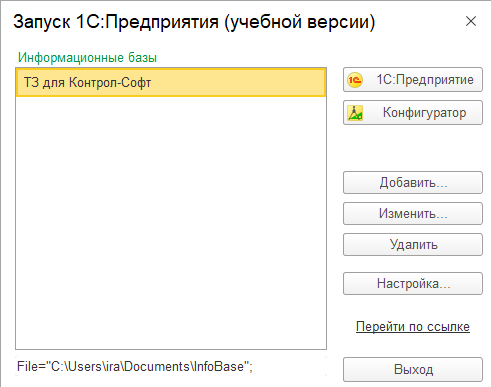
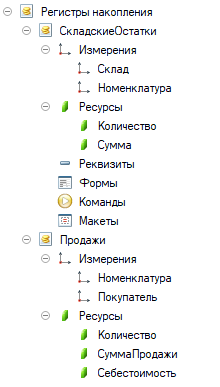
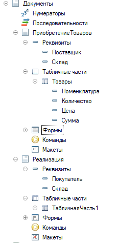
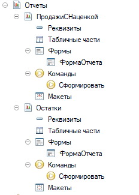
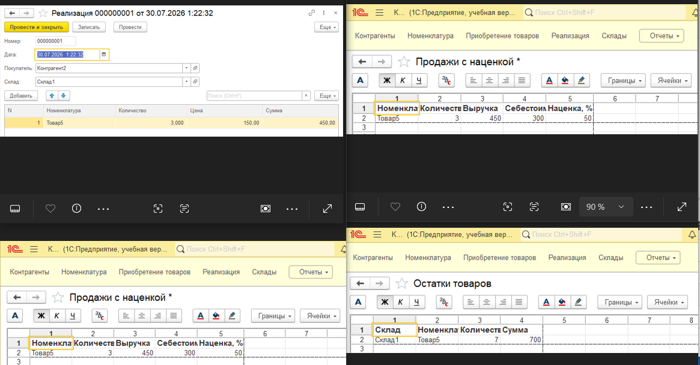
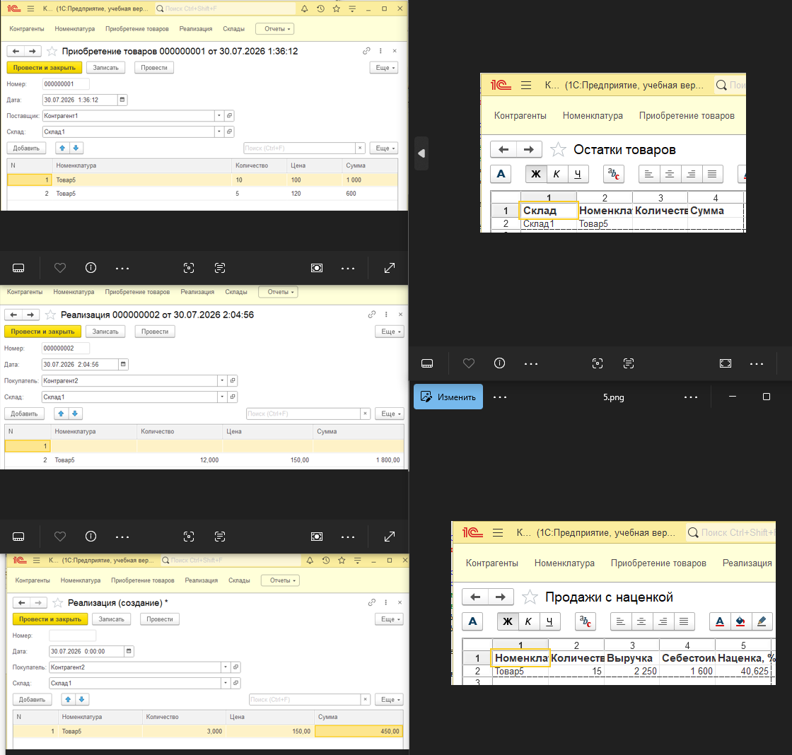

# Отчет по выполнению тестового задания

## Развертывание инфраструктуры

**1. Установлена платформа 1С:Предприятие (учебная версия)**
- Версия: 8.3.27.1508
- Ссылка: https://online.1c.ru/catalog/programs/program/28766016/

**2. Создана информационная база**
- Конфигуратор готов к разработке

  

---

## Создание справочников

### 1. **Номенклатура** (`Номенклатура`)
   - Назначение: список товаров

### 2. **Склады** (`Склады`)
   - Назначение: список складов

### 3. **Контрагенты** (`Контрагенты`)
   - Назначение: список поставщиков и покупателей

---

## Создание регистров накопления

### 1. Регистр «Складские остатки»
- **Имя:** `СкладскиеОстатки`
- **Вид:** Регистр остатков
- **Измерения:** `Склад`, `Номенклатура`
- **Ресурсы:** `Количество` (Число, 15, 3), `Сумма` (Число, 15, 2)
- **Назначение:** Хранение текущих остатков товаров на складах

### 2. Регистр «Выручка по продажам»
- **Имя:** `Продажи`
- **Вид:** Регистр оборотов
- **Измерения:** `Номенклатура`, `Покупатель`
- **Ресурсы:** `Количество`, `СуммаПродажи`, `Себестоимость`
- **Назначение:** Хранение данных о продажах и себестоимости
- 

---

## Создание документов

### 1. Документ «Приобретение товаров»
- **Имя:** `ПриобретениеТоваров`
- **Реквизиты шапки:** `Поставщик` (Контрагенты), `Склад` (Склады)
- **Табличная часть:** `Товары`
  - `Номенклатура` → СправочникСсылка.Номенклатура
  - `Количество` → Число (15, 3)
  - `Цена` → Число (15, 2)
  - `Сумма` → Число (15, 2)
- **Движения:** `СкладскиеОстатки` (Приход)

### 2. Документ «Реализация»
- **Имя:** `Реализация`
- **Реквизиты шапки:** `Покупатель` (Контрагенты), `Склад` (Склады)
- **Табличная часть:** `Товары`
  - `Номенклатура` → СправочникСсылка.Номенклатура
  - `Количество` → Число (15, 3)
  - `Цена` → Число (15, 2)
  - `Сумма` → Число (15, 2)
- **Движения:** `СкладскиеОстатки` (Расход), `Продажи` (Приход)

---

## Логика расчета средней себестоимости

При проведении документа **«Реализация»**:

1. Запрос к регистру `СкладскиеОстатки` для получения текущего остатка товара.
2. Если остаток = 0, себестоимость списания = 0.
3. Иначе рассчитывается средняя себестоимость:  
   `СебестоимостьЕдиницы = СуммаОстатка / КоличествоОстатка`
4. Сумма списания:  
   `СуммаСписания = СебестоимостьЕдиницы × КоличествоПродажи`
5. В регистр `СкладскиеОстатки` записывается **Расход** с суммой списания.
6. В регистр `Продажи` записывается **Приход** с суммой продажи и себестоимостью.

---

## Автоматический расчет суммы в документах

В форме документов **«Приобретение товаров»** и **«Реализация»** добавлен обработчик события **«ПриИзменении»** для полей **«Цена»** и **«Количество»**. При изменении любого из этих полей сумма пересчитывается автоматически:

Сумма = Цена × Количество

---

## Создание отчетов

### 1. Отчет «Остатки»
- **Источник данных:** Регистр `СкладскиеОстатки`
- **Группировка:** Склад, Номенклатура
- **Выводимые поля:** Склад, Номенклатура, Количество, Сумма

### 2. Отчет «Продажи с наценкой»
- **Источник данных:** Регистр `Продажи`
- **Группировка:** Номенклатура
- **Выводимые поля:** Номенклатура, Количество, Выручка, Себестоимость, Наценка, %
- **Формула наценки:** `(Выручка − Себестоимость) / Себестоимость × 100%`

---

## Тестирование

### Тестовые данные

**Справочники:**
- Товары: Товар1, Товар2, Товар3, Товар5
- Склады: Склад1
- Контрагенты: Контрагент1, Контрагент2

---

### Тест 1: Одна покупка, одна продажа

| Операция | Товар | Количество | Цена | Сумма |
|----------|-------|------------|------|-------|
| Покупка | Товар5 | 10 | 100 | 1 000 |
| Продажа | Товар5 | 3 | 150 | 450 |

**Результаты:**

| Отчет | Показатель | Значение |
|-------|------------|----------|
| Остатки | Количество | 7 |
| Остатки | Сумма | 700 |
| Продажи | Себестоимость | 300 |
| Продажи | Наценка | 50% |

---

### Тест 2: Две покупки по разным ценам, две продажи по одной цене

| Операция | Товар | Количество | Цена | Сумма |
|----------|-------|------------|------|-------|
| Покупка 1 | Товар5 | 10 | 100 | 1 000 |
| Покупка 2 | Товар5 | 5 | 120 | 600 |
| Продажа 1 | Товар5 | 3 | 150 | 450 |
| Продажа 2 | Товар5 | 12 | 150 | 1800 |

**Ожидаемые результаты:**

| Отчет | Показатель | Значение |
|-------|------------|----------|
| Остатки | Количество | 0 |
| Остатки | Сумма | 0 |
| Продажи | Себестоимость | 106,67 |
| Продажи | Наценка | 40,62% |

---

## Заключение

Все пункты технического задания выполнены:
- Документ «Приобретение товаров»
- Документ «Реализация»
- Отчет по складским остаткам
- Отчет по продажам с наценкой
- Регистры накопления (Складские остатки, Выручка по продажам)
- Списание стоимости по среднему
- Справочники (Номенклатура, Склады, Контрагенты)

