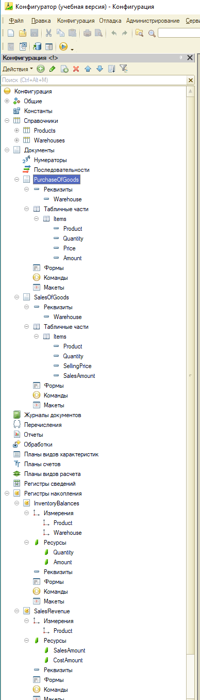

# Отчет по выполнению тестового задания

## Развертывание инфраструктуры

### Выполненные действия:

**1. Установлена платформа 1С:Предприятие (учебная версия)**

**2. Создана информационная база**

**Конфигуратор готов к разработке**

## Создание справочников

### Выполненные действия:

**1. Создан справочник "Товары"**
   - **Имя:** `Products`
   - **Синоним:** `Товары`
   - **Назначение:** Список товаров

**2. Создан справочник "Склады"**
   - **Имя:** `Warehouses`
   - **Синоним:** `Склады`
   - **Назначение:** Список складов

**Структура готова для заполнения тестовыми данными**

## Создание регистров накопления

### Выполненные действия:

**1. Создан регистр "Складские остатки"**
   - **Имя:** `InventoryBalances`
   - **Вид:** Регистр остатков
   - **Измерения:** `Product` (Товар), `Warehouse` (Склад)
   - **Ресурсы:** `Quantity` (Количество), `Amount` (Сумма)
   - **Назначение:** Хранение текущих остатков товаров на складах

**2. Создан регистр "Выручка по продажам"**
   - **Имя:** `SalesRevenue`
   - **Вид:** Регистр оборотов
   - **Измерения:** `Product` (Товар)
   - **Ресурсы:** `SalesAmount` (Сумма продажи), `CostAmount` (Себестоимость)
   - **Назначение:** Хранение данных о продажах и себестоимости для расчета прибыли

**Регистры созданы, измерения и ресурсы настроены и готовы к записи движений от документов.

## Создание документов

### Выполненные действия:

**1. Создан документ "Приобретение товаров"**
   - **Имя:** `PurchaseOfGoods`
   - **Синоним:** `Приобретение товаров`
   - **Реквизиты шапки:** `Warehouse` (Склад)
   - **Табличная часть:** `Items` (Товары)
     - `Product` (Товар) → тип: СправочникСсылка.Products
     - `Quantity` (Количество) → тип: Число (15, 3)
     - `Price` (Цена) → тип: Число (15, 2)
     - `Amount` (Сумма) → тип: Число (15, 2)
   - **Назначение:** Фиксация поступления товаров на склад

**2. Создан документ "Реализация товаров"**
   - **Имя:** `SalesOfGoods`
   - **Синоним:** `Реализация товаров`
   - **Реквизиты шапки:** `Warehouse` (Склад)
   - **Табличная часть:** `Items` (Товары)
     - `Product` (Товар) → тип: СправочникСсылка.Products
     - `Quantity` (Количество) → тип: Число (15, 3)
     - `SellingPrice` (Цена продажи) → тип: Число (15, 2)
     - `SalesAmount` (Сумма продажи) → тип: Число (15, 2)
   - **Назначение:** Фиксация продажи товаров со склада

**Документы созданы, структура шапки и табличных частей настроена, все готово  к написанию кода проведения.

## Общая структура конфигурации

### Дерево объектов:

